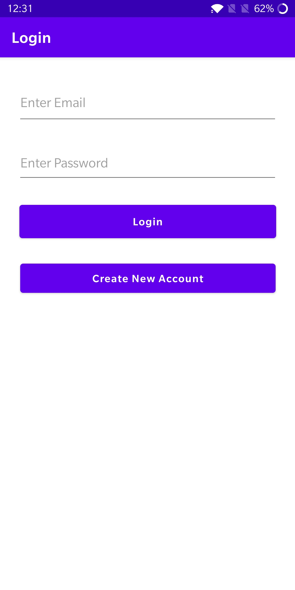
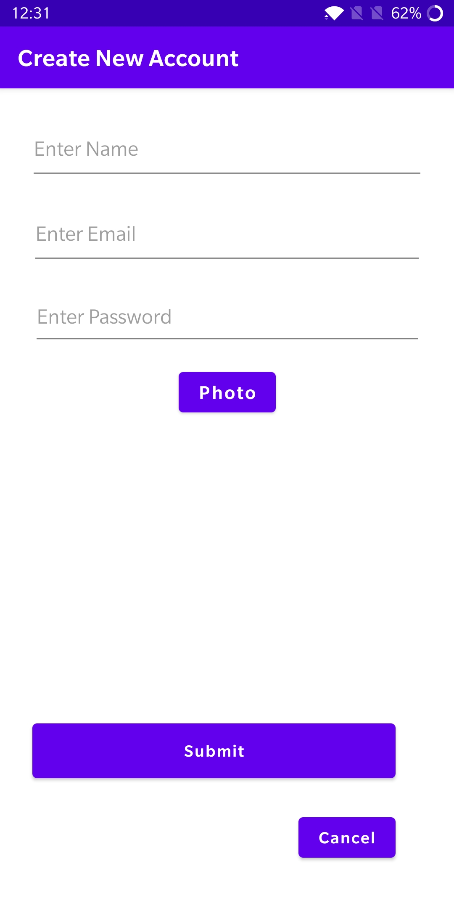
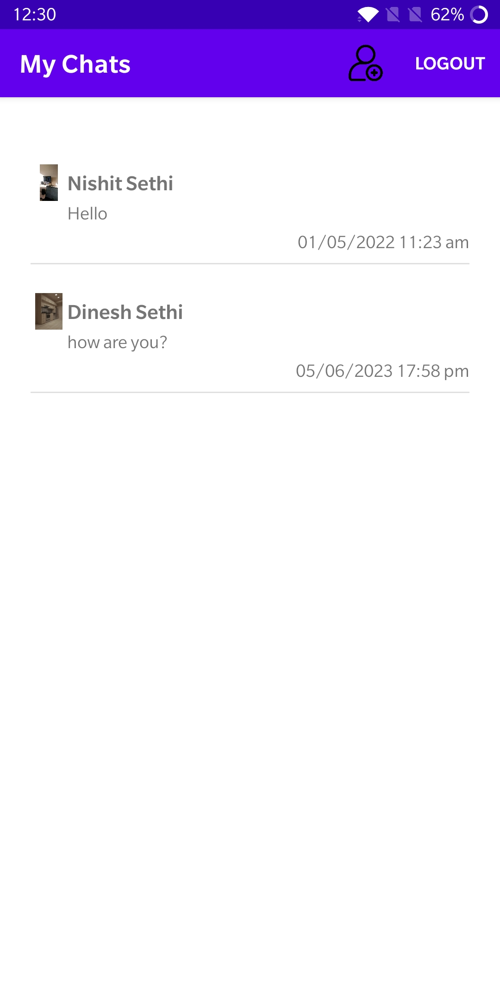
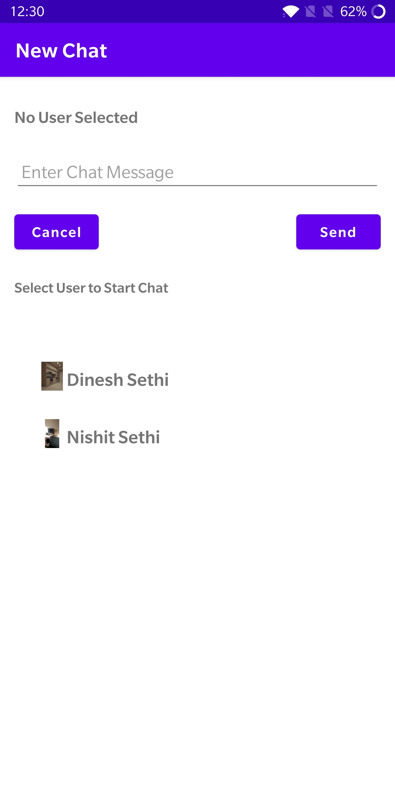
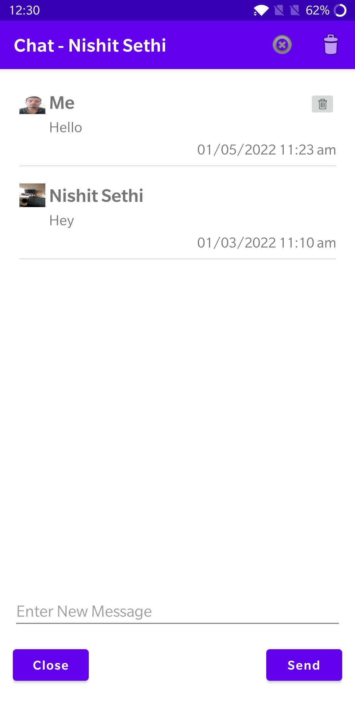

# <h1>Chatting</h1>
Chatting is an android app which enables users to interact with each other. This app allows users to create a profile using their email and photo, enabling them to interact with other users. Users can easily delete individual messages or entire chat sessions, as well as block other users to maintain their privacy. Additionally, users can update their own profile information, such as their name or profile picture, and browse through other users' profiles to discover new connections. With these features, the app provides a convenient and secure platform for users to connect with each other and share their interests.

# <h2>Features</h2>
A user creates his profile using his Email and Photo to interact with other users. 
Users can delete a message, delete a chat session, and block other users 
Users can update their profiles and look at other users' profiles 

<h2>Getting Started</h2>
<h3>Prerequisites</h3>
To use the app, you need to have an Android device with Android OS version 5.0 or higher.

# <h3>Installation</h3>
You can download the app using APK file present in this git repository.

<h3>Screenshots</h3>

  
  
 

  
  
  

<h3>Usage</h3>
Before using the app, users are required to register by providing their email and profile photo. Once logged in, users will see the chat home page. To start a new chat, users can select any of their registered contacts and begin chatting. On the home page, users can view all of their previous chats, including the last message sent and the time it was sent.
<h2>Architecture</h2>
A brief explanation of the app's architecture, including any patterns or libraries used.

<h2>Libraries Used</h2>
OkHttpClient - Factory for calls, which can be used to send HTTP requests and read their responses.

<h2> Acknowledgments</h2>
This app uses the Google Firebase to authenticate users and uses Firestore database to store all other necessary details to run the app.

<h2>Contact</h2>
If you have any questions or comments about the App, please contact me at viditsethi13@gmail.com.
